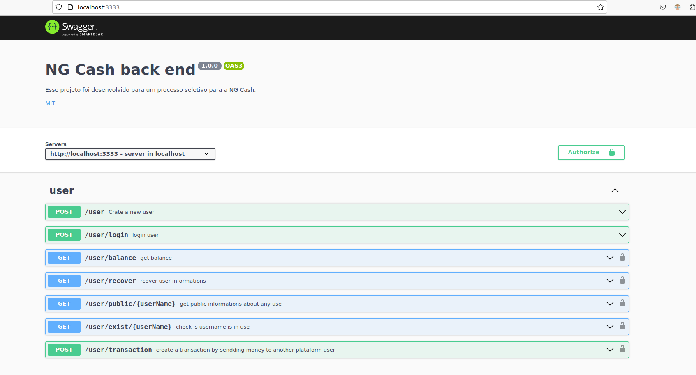

# Processo seletivo com a NG CASH

Este projeto este foi desenvolvido para o processo seletivo com a NG Cash para ele era requisitado um projeto full stack com back end e front end usando frameworks nodes opcionais. Eu optei por utilizar no backend o express que é bem reconhecido na comunidade por ser bastante flexível e no front utilizei Nextjs pois além de oferecer o que o react proporciona, ele também tem a capacidade de trabalhar em server side, com servidor próprio e geração de páginas estáticas.

#

## Executando o projeto
Após ter clonado o projeto, você precisa declarar as variáveis de ambiente na pasta NG_Backend, abaixo estão as propriedades para você preencher.

Para executar o projeto é necessário ter o docker engine e o docker compose instalado, com eles instalados você pode rodar o comando: 
```terminal
docker compose up --build
```
para rodar o projeto.

[./NG_Backend/.env](./NG_Backend/)
```env
PORT= 3333
HASH_SALT= 12
JWT_SECRET= SECRET
TIME_EXPIRATION_TOKEN= 24h

DATABASE_CONTAINER= ng_database
POSTGRES_DB= ngcashdatabase
POSTGRES_USER= userformpostgresdatabase
POSTGRES_PASSWORD= mustbestrongapassword

DATABASE_URL= postgres://${POSTGRES_USER}:${POSTGRES_PASSWORD}@${DATABASE_CONTAINER}:5432/{POSTGRES_DB}?schema=public
```
#

## Backend 
O back end foi construído utilizando express junto com várias outras libs com o modelo REST API. Você pode consultar a documentação da api na raiz do domínio da aplicação em http://localhost:33333.


Stacks utilizadas: Express, Typescript, prisma e prisma/client Dockerfile, brypt, body-parser, class-validator, cors, dotenv, jswonwebtoken, pdfmake, swagger-ui-express, vitest.

#

## Frontend
O frontend subirá em http://localhost:3000. Para usar a plataforma é necessário ter duas contas para elas realizarem transações entre si.

